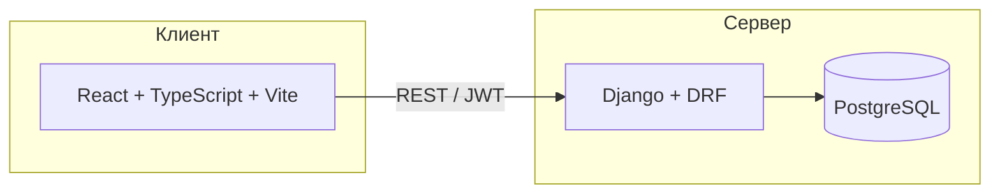

# Система управления складом и заказами

Курсовой проект по дисциплине **«Разработка клиент-серверных приложений»** (РТУ МИРЭА, направление 09.03.04 «Информатика и вычислительная техника»).

Веб-приложение (MVP) для учёта товаров на складе, оформления заказов с позициями и управления статусами отгрузки. Реализованы роли пользователей, JWT-аутентификация, REST API и клиент на React.

**Репозиторий:** https://github.com/mIsDMMiSdm/prksp_curs_project

---

## Содержание

- [Возможности](#возможности)
- [Архитектура](#архитектура)
- [Стек технологий](#стек-технологий)
- [Быстрый старт (Docker)](#быстрый-старт-docker)
- [Локальная разработка](#локальная-разработка)
- [Демо-учётные записи](#демо-учётные-записи)
- [Роли и права](#роли-и-права)
- [Жизненный цикл заказа](#жизненный-цикл-заказа)
- [REST API](#rest-api)
- [Структура репозитория](#структура-репозитория)
- [Деплой на Railway](#деплой-на-railway)
- [Диаграммы](#диаграммы)

---

## Возможности

| Область | Описание |
|---------|----------|
| **Каталог** | Товары (название, SKU, цена, остаток); просмотр всем авторизованным, редактирование — менеджеру склада |
| **Заказы** | Создание с несколькими позициями; **списание остатка** при создании; **возврат на склад** при отмене |
| **Статусы** | `new` → `in_progress` → `shipped`; отмена `cancelled` из допустимых состояний |
| **Безопасность** | JWT (access + refresh), разграничение прав по ролям на API и во фронтенде |
| **Инфраструктура** | Docker Compose (dev и prod), деплой на Railway |

---

## Архитектура



Слои backend: **views (API)** → **services (бизнес-логика)** → **models (ORM)**.

---

## Стек технологий

| Слой | Технологии |
|------|------------|
| Frontend | React 19, TypeScript, Vite, React Router |
| Backend | Python 3.12, Django 5, Django REST Framework |
| Auth | djangorestframework-simplejwt |
| БД | PostgreSQL (Docker / Railway); SQLite — опционально для локальной разработки |
| Деплой | Docker, Gunicorn, nginx (prod), [Railway](https://railway.com) |

---

## Быстрый старт (Docker)

**Требования:** [Docker Desktop](https://www.docker.com/products/docker-desktop/)

Из корня репозитория:

```powershell
docker compose up --build
```

| Сервис | URL |
|--------|-----|
| Frontend (Vite, dev) | http://localhost:5173 |
| Backend API | http://localhost:8000 |
| Health-check | http://localhost:8000/api/health/ |
| PostgreSQL | `localhost:5432` |

При старте backend автоматически выполняются миграции и команда `seed_demo` (пользователи и товары — см. ниже).

Остановка:

```powershell
docker compose down
```

С удалением тома БД:

```powershell
docker compose down -v
```

### Production-подобный режим

Статическая сборка фронтенда и nginx (прокси `/api` → backend):

```powershell
docker compose -f docker-compose.prod.yml up --build
```

Приложение: **http://localhost:8080**

---

## Локальная разработка

### Backend

```powershell
cd backend
python -m venv .venv
.\.venv\Scripts\Activate.ps1
pip install -r requirements.txt
copy ..\.env.example ..\.env
python manage.py migrate
python manage.py seed_demo
python manage.py runserver
```

Для PostgreSQL локально задайте в `.env`: `USE_POSTGRES=1` и параметры подключения (см. `.env.example`).

### Frontend

В отдельном терминале:

```powershell
cd frontend
copy .env.example .env
npm install
npm run dev
```

По умолчанию API: `http://127.0.0.1:8000` (`VITE_API_URL` в `frontend/.env`).

---

## Демо-учётные записи

Создаются командой `python manage.py seed_demo`:

| Логин | Роль | Пароль |
|-------|------|--------|
| `warehouse1` | Менеджер склада | `demo12345` |
| `logistic1` | Логист | `demo12345` |
| `employee1` | Сотрудник | `demo12345` |

В БД также загружается демо-каталог (крепёж, упаковка и т.п.).

---

## Роли и права

| Роль | Код | Интерфейс | API |
|------|-----|-----------|-----|
| **Менеджер склада** | `warehouse_manager` | Каталог товаров, изменение остатков | CRUD товаров, `adjust-stock`, `set-quantity` |
| **Логист** | `logistic` | Все заказы, смена статуса, отмена | Список всех заказов, `set-status`, `cancel`; создание заказа через API |
| **Сотрудник** | `employee` | Свои заказы, создание нового | Только свои заказы, создание заказа |

При **создании заказа** количество списывается с `products.quantity`. При **отмене** — возвращается на склад.

---

## Жизненный цикл заказа

```
new (Новый) → in_progress (В обработке) → shipped (Отгружен)
                    ↘ cancelled (Отменён) ↗
```

- Переходы между статусами контролируются на backend (`orders/services.py`).
- Из `shipped` и `cancelled` дальнейшие переходы недоступны.
- Отмену и смену статуса выполняет **логист**.

Диаграмма состояний: `docs/diagrams/order-state.puml`

---

## REST API

Базовый префикс: `/api/`

### Система

| Метод | Путь | Описание |
|-------|------|----------|
| GET | `/api/health/` | Проверка работоспособности |

### Аутентификация (`/api/auth/`)

| Метод | Путь | Описание |
|-------|------|----------|
| POST | `/register/` | Регистрация |
| POST | `/login/` | Вход (JWT access + refresh) |
| POST | `/refresh/` | Обновление access-токена |
| GET | `/me/` | Текущий пользователь |

Заголовок: `Authorization: Bearer <access_token>`

### Товары

| Метод | Путь | Описание |
|-------|------|----------|
| GET | `/api/products/` | Список (`?in_stock=1` — только в наличии) |
| POST | `/api/products/` | Создание (менеджер склада) |
| GET/PATCH/DELETE | `/api/products/{id}/` | Просмотр / изменение / удаление |
| POST | `/api/products/{id}/adjust-stock/` | Изменение остатка (+/−) |
| POST | `/api/products/{id}/set-quantity/` | Установка остатка |

### Заказы

| Метод | Путь | Описание |
|-------|------|----------|
| GET | `/api/orders/` | Список (сотрудник — только свои) |
| POST | `/api/orders/` | Создание с позициями |
| GET | `/api/orders/{id}/` | Детали заказа |
| GET | `/api/orders/my/` | Заказы текущего пользователя |
| POST | `/api/orders/{id}/set-status/` | Смена статуса (логист) |
| POST | `/api/orders/{id}/cancel/` | Отмена (логист) |

Пример тела создания заказа:

```json
{
  "items": [
    { "product_id": 1, "quantity": 10 },
    { "product_id": 2, "quantity": 5 }
  ]
}
```

---

## Структура репозитория

```
prksp_curs_project/
├── backend/
│   ├── config/              # settings, urls, health
│   ├── users/               # User, роли, JWT, seed_demo
│   ├── catalog/             # товары и остатки
│   ├── orders/              # заказы и позиции
│   ├── Dockerfile           # локальный Docker
│   ├── Dockerfile.railway   # Railway
│   └── railway.toml
├── frontend/
│   ├── src/                 # страницы, API-клиент, роутинг по ролям
│   ├── Dockerfile
│   ├── Dockerfile.prod
│   └── Dockerfile.railway
├── docs/diagrams/           # UML (PlantUML, draw.io)
├── scripts/
│   └── deploy-railway.ps1   # помощник деплоя на Railway
├── docker-compose.yml
├── docker-compose.prod.yml
└── .env.example
```

---

## Деплой на Railway

Проект разворачивается как **три сервиса** в одном Railway Project:

1. **PostgreSQL** (плагин базы данных)
2. **Backend** — Root Directory: `backend`
3. **Frontend** — Root Directory: `frontend`

### Backend — переменные

| Переменная | Значение |
|------------|----------|
| `DATABASE_URL` | Reference → PostgreSQL |
| `RAILWAY_DEPLOY` | `1` |
| `DJANGO_DEBUG` | `0` |
| `DJANGO_SECRET_KEY` | случайная длинная строка |
| `RUN_SEED_DEMO` | `1` (только первый деплой) |
| `FRONTEND_URL` | публичный URL фронтенда |

Проверка: `https://<backend-domain>/api/health/`

### Frontend — переменные

| Переменная | Значение |
|------------|----------|
| `VITE_API_URL` | `https://<backend-domain>` (без `/` в конце) |

> `VITE_API_URL` подставляется **при сборке**. После изменения выполните **Redeploy** frontend.

### CORS

В backend задайте `FRONTEND_URL` и перезапустите сервис.

Автоматизация (CLI): `scripts/deploy-railway.ps1` (нужны `railway login` или `RAILWAY_TOKEN`).

### Типичные проблемы

| Проблема | Решение |
|----------|---------|
| CORS в браузере | `FRONTEND_URL`, `RAILWAY_DEPLOY=1`, redeploy backend |
| API 404 на фронте | Проверьте `VITE_API_URL`, redeploy frontend |
| Пустая БД | `RUN_SEED_DEMO=1`, redeploy backend |
| Кракозябры в UI | UTF-8 в исходниках; `frontend/.gitattributes`, charset в nginx |

---


